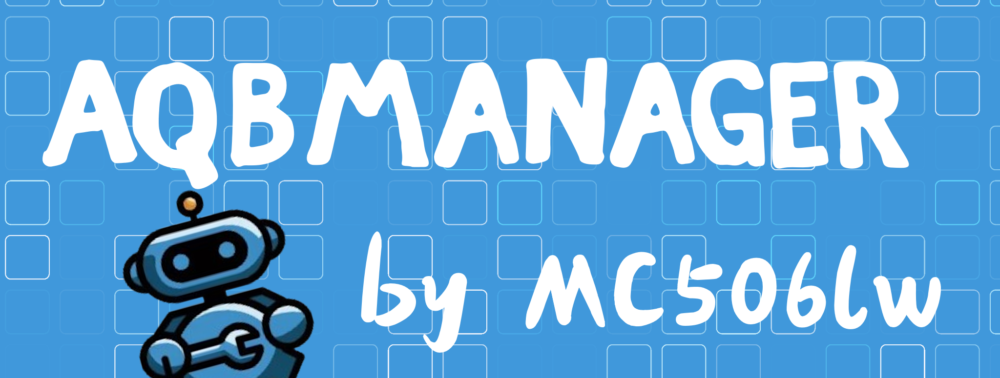

### AQBManager：一个现代化的 AQQBot 管理平台

**AQBManager** (AQBM) 是一个现代化的 AQQBot 管理平台，提供直观的 Web 界面来管理多个 AQQBot 服务器实例。  
通过 AQBM，您可以轻松监控服务器状态、配置插件参数、管理 OneBot 连接等。

**AQQBot 仓库**: [AQQBot](https://github.com/alazeprt/AQQBot)
**AQQBot 文档**: [aqqbot.alazeprt.top](https://aqqbot.alazeprt.top/)

### 🎯 核心功能
- ✅ **多服务器管理** - 集中管理多个 AQQBot 服务器实例
- ✅ **实时监控** - 查看 CPU、内存使用率和接口请求量等系统指标
- ✅ **插件配置** - 在线修改 AQQBot 插件配置项
- ✅ **OneBot 配置** - 管理 OneBot 后端连接信息
- ✅ **现代化界面** - 基于 Nuxt 3 和 DaisyUI 构建的响应式 UI

---

## ⭐ 点个 Star 支持我们

如果您觉得 AQBM 有用，请在 GitHub 上给我们一个 Star，这将帮助我们获得更多关注并推动项目发展。

**💬 加入我们的 QQ 群:** [669737143](https://qm.qq.com/q/plY1nOuHXW)

---

## 🚀 快速部署

### 安装步骤

1. 下载项目构建包
- 从 [Releases 页面](https://github.com/mc506lw/AQBManager/releases) 下载最新版本的构建包。
- 解压构建包到您选择的目录。

2. 直接启动
点击 `start.bat` 或 `start.sh` 启动应用

3. 访问应用
访问 `http://localhost:3000` 查看应用。

---

## ✨ 主要特性

### 🖥️ 仪表板
实时监控所有连接服务器的系统状态，包括 CPU 使用率、内存占用和接口请求量。

### 📡 服务器管理
添加、编辑和删除服务器实例，管理服务器连接信息。

### ⚙️ 插件配置
在线修改 AQQBot 插件配置项，支持布尔值、字符串和数组等多种配置类型。

### 🤖 OneBot 配置
配置和管理 OneBot 后端连接信息，检查连接状态。

### 🔐 认证系统
内置基于 bcrypt 的用户认证系统，确保管理界面安全。

### 🌐 响应式设计
基于 Tailwind CSS 和 DaisyUI 构建，适配各种设备屏幕尺寸。

---

## 🛠️ 技术栈

- **前端框架**: [Nuxt 3](https://nuxt.com/)
- **UI 框架**: [DaisyUI](https://daisyui.com/)
- **样式**: [Tailwind CSS](https://tailwindcss.com/)
- **图表**: [Chart.js](https://www.chartjs.org/)
- **状态管理**: [Pinia](https://pinia.vuejs.org/)
- **后端**: [Nuxt Server Routes](https://nuxt.com/docs/guide/directory-structure/server)
- **WebSocket**: [ws](https://github.com/websockets/ws)

---

## 🤝 贡献

我们欢迎任何形式的贡献！如果您想为 AQBM 做出贡献，请 Fork 项目并提交 Pull Request。

### **📄 许可证**

本项目采用 **Apache License 2.0** 许可证。详情请查看 [LICENSE](LICENSE) 文件。

---

## 🌍 社区

- **GitHub Issues:** 报告 bug、请求新功能和跟踪开发进度。[提交问题](https://github.com/mc506lw/AQBManager/issues)

- **QQ 群:** 获取实时支持，与社区交流并保持更新。[加入我们](https://qm.qq.com/q/plY1nOuHXW)

---

## 👥 作者

- **插件作者**: [Alazeprt](https://github.com/Alazeprt)
- **面板作者**: [mc506lw](https://github.com/mc506lw)